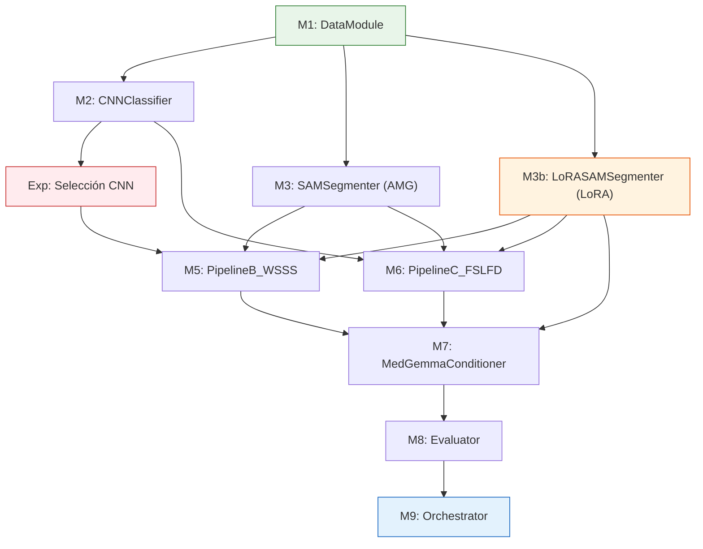

# Diseño Experimental: Pipeline MedGemma para Segmentación Oftalmológica

## Información General

- **Lenguaje:** Python 3.10+
- **Framework:** PyTorch 2.x
- **Entorno:** Google Colab Pro / GCP (GPU L4 o T4, ≥16GB VRAM)
- **Semilla global de replicabilidad:** `SEED = 42`
- **Datos:** Privados, cerrados, no publicables

---

## Datos Disponibles

Cada imagen del dataset contiene las siguientes anotaciones (almacenadas en `annotations.json`):

| Campo | Tipo | Ejemplo |
|-------|------|---------|
| `image_filename` | str | "1209_right.jpg" |
| `label` | str | "Pathological" o "Normal" |
| `transcription` | Texto libre | "Clinical photograph of the right eye showing..." |
| `locs_data.conditions` | list[str] | ["glaucoma"] |
| `locs_data.<enfermedad>` | dict | Grading estructurado: `cup_to_disc_ratio`, `neuroretinal_rim`, etc. (glaucoma) |
| `segmentation_mask` | Máscara binaria (H×W) | Ground truth pixel-wise en `masks/` |

### Splits del dataset

```python
# Usar sklearn con semilla fija
from sklearn.model_selection import train_test_split

train, temp = train_test_split(data, test_size=0.30, random_state=42, stratify=data['label'])
val, test   = train_test_split(temp, test_size=0.50, random_state=42, stratify=temp['label'])
# Resultado: 70% train, 15% val, 15% test
```

> Los splits se generan UNA vez y se guardan en `splits.json` para que todos los módulos usen las mismas particiones.

---

## Arquitectura Modular: Piezas de Lego

Cada módulo es **independiente** con interfaces definidas (input/output). Un investigador puede trabajar en su módulo sin conocer los internos de los demás.

```
┌────────────────────────────────────────────────────────┐
│                    MÓDULOS (8 piezas)                   │
│                                                        │
│  M1: DataModule          → Carga y preprocesa datos    │
│  M2: CNNClassifier       → Clasifica + Grad-CAM       │
│  M3: SAMSegmenter        → SAM 2 sin entrenar (AMG)   │
│  M3b: LoRASAMSegmenter   → SAM 2 fine-tuned (LoRA)    │
│  M5: PipelineB_WSSS      → Selección por Grad-CAM     │
│  M6: PipelineC_FSLFD     → Filtro por KDE             │
│  M7: MedGemmaConditioner → 6 condiciones de ablation  │
│  M8: Evaluator           → Métricas y estadísticas    │
│  M9: Orchestrator        → Conecta todo               │
└────────────────────────────────────────────────────────┘
```

---

## M1: DataModule

**Responsable:** Investigador 1
**Archivo:** `modules/data_module.py`

### Interfaz

```python
class DataModule:
    def __init__(self, config: dict):
        """
        config = {
            "data_dir": str,           # Ruta al dataset
            "splits_file": str,        # splits.json
            "image_size": (448, 448),   # Para CNN/MedGemma
            "sam_image_size": (1024, 1024),  # Para SAM
            "batch_size": 16,
            "seed": 42,
            "num_workers": 2
        }
        """

    def get_train_loader(self) -> DataLoader: ...
    def get_val_loader(self) -> DataLoader: ...
    def get_test_loader(self) -> DataLoader: ...

    def get_sample(self, idx: int) -> dict:
        """
        Returns:
            {
                "image": Tensor (3, H, W),          # Imagen normalizada
                "image_raw": ndarray (H, W, 3),     # Imagen sin normalizar (para SAM)
                "disease_category": str,             # "glaucoma" (de locs_data.conditions[0])
                "disease_grading": dict,             # {"cup_to_disc_ratio": 3, ...}
                "segmentation_mask": Tensor (1, H, W),  # Máscara GT binaria
                "expert_description": str,           # Texto del oftalmólogo (campo transcription)
                "image_id": str                      # Identificador único
            }
        """
```

### Consideraciones
- Normalización ImageNet para la CNN: `mean=[0.485, 0.456, 0.406], std=[0.229, 0.224, 0.225]`
- SAM requiere imagen en formato RGB uint8 a 1024×1024
- MedGemma requiere preprocesamiento propio vía `AutoProcessor`
- Data augmentation SOLO en train: rotación ±15°, flip horizontal, ajuste brillo/contraste

---

## M2: CNNClassifier

**Responsable:** Investigador 2
**Archivo:** `modules/cnn_classifier.py`

### Interfaz

```python
class CNNClassifier:
    def __init__(self, config: dict):
        """
        config = {
            "backbone": str,        # "resnet18", "resnet34", "resnet50", "efficientnet_b0", "densenet121"
            "num_classes": int,     # Número de categorías (configurable; actualmente 2: glaucoma, normal)
            "pretrained": True,     # ImageNet pretrained
            "seed": 42
        }
        """

    def train(self, train_loader, val_loader, epochs=30, lr=1e-4, patience=5) -> dict:
        """Returns: {"best_val_acc": float, "best_val_f1": float, "history": list}"""

    def predict(self, image: Tensor) -> dict:
        """
        Input: image (3, H, W) normalizada
        Returns:
            {
                "prediction": str,                    # "glaucoma"
                "distribution": dict[str, float],     # {"glaucoma": 0.92, "normal": 0.08}
                "grading": str                        # Subclasificación si aplica
            }
        """

    def get_gradcam(self, image: Tensor) -> ndarray:
        """
        Input: image (3, H, W)
        Returns: gradcam_map (H, W) valores en [0, 1]
        """

    def save(self, path: str): ...
    def load(self, path: str): ...
```

### Experimento de selección de backbone

Antes de integrar al pipeline, se corre este experimento independiente:

```python
# experiment_cnn_selection.py
BACKBONES = ["resnet18", "resnet34", "resnet50", "efficientnet_b0", "densenet121"]
SEEDS = [42, 123, 456, 789, 1024]  # 5 runs para estabilidad

for backbone in BACKBONES:
    for seed in SEEDS:
        model = CNNClassifier({"backbone": backbone, "seed": seed, ...})
        results = model.train(train_loader, val_loader)
        gradcam_iou = evaluate_gradcam_quality(model, test_loader, gt_masks)
        log_results(backbone, seed, results, gradcam_iou)
```

**Métricas por backbone:**

| Dimensión | Métricas |
|-----------|----------|
| Clasificación | Accuracy, F1-macro, matriz de confusión |
| Grad-CAM | IoU(Grad-CAM, GT mask), pointing accuracy, cobertura |
| Costo | Params, VRAM (MB), tiempo inferencia (ms) |
| Few-shot | Accuracy con N=50, N=100, N=full |

**Criterio de selección:**
```
Score = 0.30×F1 + 0.30×IoU_GradCAM + 0.20×Acc@N50 + 0.20×(1-VRAM_norm)
```

---

## M3: SAMSegmenter

**Responsable:** Investigador 3
**Archivo:** `modules/sam_segmenter.py`

### M3a: SAMSegmenter (Sin Entrenar)

Usa SAM 2.1 Tiny en modo AMG para generar máscaras candidatas automáticamente.

```python
class SAMSegmenter:
    def __init__(self, config: dict):
        """
        config = {
            "model_type": str,              # "hiera_t" (SAM 2 Tiny)
            "checkpoint": str,              # "facebook/sam2.1-hiera-tiny"
            "config_file": str,             # "configs/sam2.1/sam2.1_hiera_t.yaml"
            "device": str,                  # "cuda"
            "points_per_side": int,         # 32 (grilla 32x32 = 1024 puntos)
            "pred_iou_thresh": float,       # 0.7
            "stability_score_thresh": float, # 0.8
            "seed": int                     # 42
        }
        """

    def generate_candidates(self, image_raw: ndarray) -> list[dict]:
        """
        Input: image_raw (H, W, 3) uint8
        Returns: lista de candidatas ordenadas por predicted_iou descendente:
            {
                "mask": ndarray (H, W) bool,
                "predicted_iou": float,
                "stability_score": float,
                "area": int,
                "area_ratio": float,
                "bbox": (x, y, w, h)
            }
        """
```

### M3b: LoRASAMSegmenter (Fine-tuned con LoRA)

Hereda de SAMSegmenter. Añade LoRA al Image Encoder (Hiera) para adaptar SAM 2 a imágenes oftalmológicas.

```python
class LoRASAMSegmenter(SAMSegmenter):
    def __init__(self, config: dict):
        """
        Hereda config de SAMSegmenter y añade:
        config = {
            ... (mismos campos que SAMSegmenter) ...
            "lora_rank": int,         # 8
            "lora_alpha": int,        # 16
            "lora_epochs": int,       # 50
            "lora_lr": float          # 0.0001
        }
        """

    def train(self, train_images: list, train_masks: list,
              val_images: list, val_masks: list) -> dict:
        """
        Entrena SAM 2 con LoRA.
        Returns: {"history": list, "best_val_iou": float, "best_epoch": int}
        """

    def predict(self, image_raw: ndarray) -> dict:
        """
        Genera una máscara directa (sin candidatas).
        Returns: {"mask": ndarray (H, W) bool, "confidence": float}
        """

    def save(self, path: str) -> None:
        """Guarda solo adapters LoRA + Mask Decoder (~10MB)."""

    def load(self, path: str) -> None:
        """Carga adapters sobre el modelo base reconstruido."""
```

### Consideraciones
- SAM 2 espera imágenes RGB uint8 a 1024×1024
- Filtrar candidatas por área mínima (>0.5% de la imagen) y máxima (<80%)
- Ordenar por `predicted_iou` descendente
- LoRA se aplica a Q y V projections del Image Encoder (Hiera)
- Mask Decoder se desbloquea completamente para entrenar (~4M params)

---

## ~~M4: PipelineA_LoRA (Segmentador Directo)~~ — DEPRECADO

> **NOTA:** La funcionalidad LoRA de Pipeline A ahora está integrada en **M3b: LoRASAMSegmenter** como subclase de SAMSegmenter. Ver sección M3 más arriba. Este módulo se mantiene como referencia histórica.

**Archivo original:** `modules/pipeline_a_lora.py` (eliminado — contenido migrado a `modules/sam_segmenter.py`)

La interfaz de `LoRASAMSegmenter` en M3 proporciona:
- `train()` — Entrena SAM 2 con LoRA
- `predict()` — Genera máscara directa
- `save()` / `load()` — Guarda/carga solo adapters (~10MB)

---

## M5: PipelineB_WSSS (Selector por Grad-CAM)

**Responsable:** Investigador 4
**Archivo:** `modules/pipeline_b_wsss.py`

### Interfaz

```python
class PipelineB_WSSS:
    def __init__(self, config: dict):
        """
        config = {
            "gradcam_percentile": 95,    # Percentil para binarizar Grad-CAM
            "seed": 42
        }
        """

    def select_mask(self, gradcam_map: ndarray, candidate_masks: list[dict]) -> dict:
        """
        Input:
            gradcam_map: (H, W) float [0, 1] — del CNNClassifier.get_gradcam()
            candidate_masks: lista de SAMSegmenter.generate_candidates()

        Returns:
            {
                "mask": ndarray (H, W) bool,
                "iou_with_gradcam": float,
                "candidate_index": int
            }
        """
```

### Flujo interno
1. Binarizar `gradcam_map` con `percentile=95`
2. Para cada candidata: calcular `IoU(candidata, gradcam_binarizado)`
3. Seleccionar la de mayor IoU

---

## M6: PipelineC_FSLFD (Filtro por KDE)

**Responsable:** Investigador 5
**Archivo:** `modules/pipeline_c_fslfd.py`

### Interfaz

```python
class PipelineC_FSLFD:
    def __init__(self, config: dict):
        """
        config = {
            "feature_extractor": str,    # "medsiglip"
            "ood_method": "iqr",         # "iqr" o "minmax"
            "seed": 42
        }
        """

    def calibrate(self, disease_name: str, support_masks: list[ndarray],
                  support_images: list[ndarray]):
        """
        Calibra KDE + ventana OOD para una enfermedad específica.
        Debe llamarse una vez por enfermedad con k=15-20 máscaras GT.
        """

    def select_mask(self, disease_prediction: str,
                    candidate_masks: list[dict],
                    original_image: ndarray) -> dict:
        """
        Input:
            disease_prediction: str — del CNNClassifier.predict()["prediction"]
            candidate_masks: lista de SAMSegmenter.generate_candidates()
            original_image: ndarray (H, W, 3)

        Returns:
            {
                "mask": ndarray (H, W) bool,
                "log_density": float,
                "in_ood_window": bool,
                "candidate_index": int
            }
        """
```

### Flujo interno
1. Extraer embedding MedSigLIP de cada candidata (imagen × máscara)
2. Usar `disease_prediction` para seleccionar el KDE y threshold `[Θ_min, Θ_max]` de esa enfermedad
3. Evaluar `ℓ*` de cada candidata contra ese KDE
4. Filtrar: solo las que cumplen `Θ_min ≤ ℓ* ≤ Θ_max`
5. De las que pasan, seleccionar la de mayor `ℓ*`

---

## M7: MedGemmaConditioner

**Responsable:** Investigador 6
**Archivo:** `modules/medgemma_conditioner.py`

### Interfaz

```python
class MedGemmaConditioner:
    def __init__(self, config: dict):
        """
        config = {
            "model_name": "google/medgemma-4b",
            "torch_dtype": "bfloat16",
            "device_map": "auto",
            "max_new_tokens": 512,
            "seed": 42
        }
        """

    def generate(self, condition: str, image_raw: ndarray,
                 mask: ndarray = None,
                 prediction: str = None,
                 distribution: dict = None) -> dict:
        """
        Input:
            condition: str — "A", "B", "C1", "C2", "D1", "D2"
            image_raw: ndarray (H, W, 3)
            mask: ndarray (H, W) bool — solo para B, D1, D2
            prediction: str — solo para C1, D1
            distribution: dict — solo para C2, D2

        Returns:
            {
                "text": str,                  # Texto generado
                "condition": str,             # Condición usada
                "prompt_used": str,           # Prompt exacto enviado
                "image_was_overlaid": bool    # Si se superpuso la máscara
            }
        """
```

### Las 6 condiciones

| Cond | `mask` | `prediction` | `distribution` |
|------|--------|-------------|----------------|
| A | None | None | None |
| B | ✅ | None | None |
| C1 | None | ✅ | None |
| C2 | None | None | ✅ |
| D1 | ✅ | ✅ | None |
| D2 | ✅ | None | ✅ |

### Overlay de máscara
Cuando `mask` se proporciona, se superpone sobre la imagen con transparencia roja:
```python
overlay = image_raw.copy()
overlay[mask] = overlay[mask] * 0.6 + np.array([255, 0, 0]) * 0.4
```

---

## M8: Evaluator

**Responsable:** Investigador 7
**Archivo:** `modules/evaluator.py`

### Interfaz

```python
class Evaluator:
    def __init__(self, config: dict):
        """
        config = {
            "bertscore_model": "microsoft/BiomedNLP-BiomedBERT-base-uncased-abstract",
            "seed": 42
        }
        """

    def evaluate_segmentation(self, pred_mask: ndarray, gt_mask: ndarray) -> dict:
        """
        Returns:
            {
                "iou": float,
                "dice": float,
                "ssim": float
            }
        """

    def evaluate_text(self, generated_text: str, reference_text: str) -> dict:
        """
        Returns:
            {
                "bertscore_f1": float,
                "finding_mentioned": bool,     # ¿Menciona la patología correcta?
            }
        """

    def statistical_test(self, scores_a: list, scores_b: list) -> dict:
        """
        Wilcoxon signed-rank test pareado.
        Returns:
            {
                "statistic": float,
                "p_value": float,
                "significant": bool,   # p < 0.05
                "effect_size": float   # r = Z / sqrt(N)
            }
        """
```

---

## M9: Orchestrator

**Responsable:** Líder del equipo
**Archivo:** `modules/orchestrator.py`

### Interfaz

```python
class Orchestrator:
    def __init__(self, config_path: str):
        """Carga config.yaml y inicializa todos los módulos."""

    def run_full_experiment(self):
        """
        Ejecuta las 36 configuraciones (6 pipelines × 6 condiciones).
        Pipelines: amg_direct, lora_direct, wsss_amg, wsss_lora, fslfd_amg, fslfd_lora
        Condiciones: A, B, C1, C2, D1, D2
        Guarda resultados en results/ con estructura:
            results/
            ├── amg_direct/
            │   ├── condition_A.json
            │   └── ...
            ├── lora_direct/
            │   └── ...
            ├── wsss_amg/
            │   └── ...
            ├── wsss_lora/
            │   └── ...
            ├── fslfd_amg/
            │   └── ...
            └── fslfd_lora/
                └── ...
        """
```

### Flujo de ejecución

```python
for image in test_set:
    # Paso 0: Validación (se asume que datos privados ya están validados)
    
    # Paso 1A: Clasificación
    classification = cnn_classifier.predict(image)
    gradcam = cnn_classifier.get_gradcam(image)
    
    # Paso 1B: Obtener máscara (2 fuentes × 3 modos)
    # SAM sin entrenar (AMG)
    candidates_amg = sam_segmenter.generate_candidates(image)
    # SAM fine-tuned con LoRA
    candidates_lora = lora_sam_segmenter.generate_candidates(image)
    mask_lora_direct = lora_sam_segmenter.predict(image)
    
    # Selección por pipeline
    mask_b_amg = pipeline_b.select_mask(gradcam, candidates_amg)
    mask_b_lora = pipeline_b.select_mask(gradcam, candidates_lora)
    mask_c_amg = pipeline_c.select_mask(classification["prediction"], candidates_amg, image)
    mask_c_lora = pipeline_c.select_mask(classification["prediction"], candidates_lora, image)
    
    # Paso 2: MedGemma (6 condiciones por combinación pipeline × variante)
    for pipeline_name, mask in [
        ("amg_direct", candidates_amg[0]),      # AMG: mejor candidata directa
        ("lora_direct", mask_lora_direct),       # LoRA: predicción directa
        ("wsss_amg", mask_b_amg),                # WSSS con AMG
        ("wsss_lora", mask_b_lora),              # WSSS con LoRA
        ("fslfd_amg", mask_c_amg),               # FD con AMG
        ("fslfd_lora", mask_c_lora),             # FD con LoRA
    ]:
        for condition in ["A", "B", "C1", "C2", "D1", "D2"]:
            result = medgemma.generate(
                condition=condition,
                image_raw=image,
                mask=mask["mask"] if condition in ["B","D1","D2"] else None,
                prediction=classification["prediction"] if condition in ["C1","D1"] else None,
                distribution=classification["distribution"] if condition in ["C2","D2"] else None
            )
            
            # Paso 3: Evaluación
            seg_metrics = evaluator.evaluate_segmentation(mask["mask"], gt_mask)
            txt_metrics = evaluator.evaluate_text(result["text"], expert_description)
            
            save_result(pipeline_name, condition, seg_metrics, txt_metrics)
```

---

## Replicabilidad

### Semillas

```python
import random, numpy as np, torch

def set_global_seed(seed=42):
    random.seed(seed)
    np.random.seed(seed)
    torch.manual_seed(seed)
    torch.cuda.manual_seed_all(seed)
    torch.backends.cudnn.deterministic = True
    torch.backends.cudnn.benchmark = False
```

Cada módulo recibe `seed` en su config y llama `set_global_seed(seed)` al inicializarse.

### Configuración centralizada

```yaml
# config.yaml
seed: 42
data:
  data_dir: "/content/drive/MyDrive/dataset/"
  splits_file: "splits.json"
  image_size: [448, 448]
  sam_image_size: [1024, 1024]
  batch_size: 16

classifier:
  backbone: "resnet18"  # Se define después del experimento de selección
  num_classes: 2   # Pathological, Normal
  pretrained: true
  epochs: 30
  lr: 0.0001
  patience: 5

sam:
  model_type: "hiera_t"
  checkpoint: "facebook/sam2.1-hiera-tiny"
  config_file: "configs/sam2.1/sam2.1_hiera_t.yaml"
  device: "cuda"
  points_per_side: 32
  pred_iou_thresh: 0.7
  stability_score_thresh: 0.8
  lora_rank: 8
  lora_alpha: 16
  lora_epochs: 50
  lora_lr: 0.0001

pipeline_a:
  lora_rank: 8
  lora_alpha: 16
  epochs: 50

pipeline_b:
  gradcam_percentile: 95

pipeline_c:
  feature_extractor: "medsiglip"
  ood_method: "iqr"

medgemma:
  model_name: "google/medgemma-4b"
  torch_dtype: "bfloat16"
  max_new_tokens: 512

evaluation:
  bertscore_model: "microsoft/BiomedNLP-BiomedBERT-base-uncased-abstract"
  significance_level: 0.05
  num_runs: 5
```

---

## Estructura de Directorios

```
project/
├── config.yaml
├── splits.json
├── modules/
│   ├── __init__.py
│   ├── data_module.py          # M1
│   ├── cnn_classifier.py       # M2
│   ├── sam_segmenter.py        # M3: SAMSegmenter + LoRASAMSegmenter
│   ├── pipeline_b_wsss.py      # M5
│   ├── pipeline_c_fslfd.py     # M6
│   ├── medgemma_conditioner.py # M7
│   ├── evaluator.py            # M8
│   ├── orchestrator.py         # M9
│   └── utils/
│       ├── seed.py
│       ├── visualization.py
│       └── logging.py
├── experiments/
│   ├── cnn_selection.py        # Experimento de selección de backbone
│   └── run_pipeline.py         # Ejecución del pipeline completo
├── results/
│   ├── cnn_selection/
│   ├── pipeline_b_wsss/
│   └── pipeline_c_fslfd/
├── checkpoints/
│   ├── cnn/
│   ├── sam_lora/               # Solo adapters LoRA (~10MB por enfermedad)
│   └── fslfd_calibration/
└── AGENTS.md
```

---

## Orden de Implementación



**Dependencias:**
- M1 no depende de nadie (se implementa primero)
- M2, M3 y M3b dependen solo de M1 (se pueden hacer en paralelo)
- M5 y M6 dependen de M2 y M3/M3b (se pueden hacer en paralelo entre sí)
- M7 depende de M5/M6 y M3b
- M8 y M9 van al final
