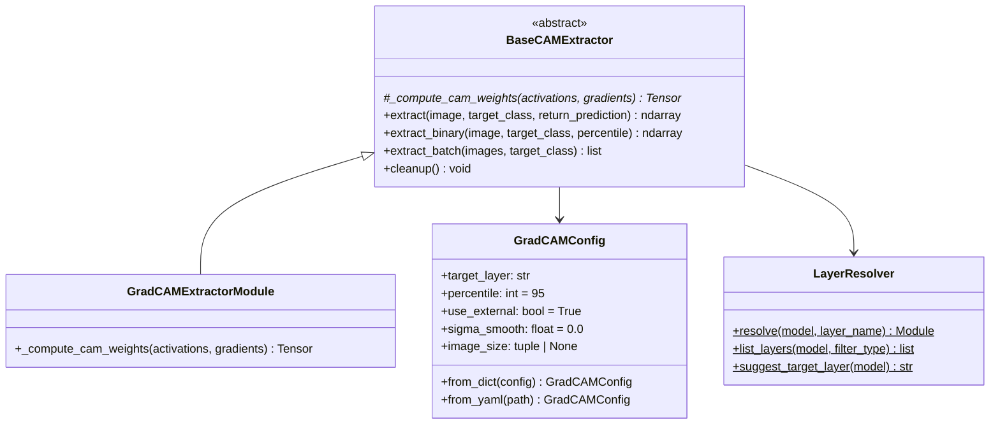

# Módulo Independiente de Grad-CAM


## Arquitectura del Módulo



## Uso Básico

```python
from modules.gradcam_module import GradCAMExtractorModule, GradCAMConfig

# 1. Configurar
config = GradCAMConfig(target_layer="layer4[-1]", percentile=95)

# 2. Crear extractor (recibe cualquier CNN ya entrenada)
extractor = GradCAMExtractorModule(model=mi_cnn, config=config)

# 3. Extraer(Con esto solo extraemos la gradcam)
heatmap = extractor.extract(image_tensor)             # (H, W) [0, 1]
binary  = extractor.extract_binary(image_tensor)       # (H, W) {0, 1}
batch   = extractor.extract_batch(batch_tensor)         # list[ndarray]

# 4. Con predicción(Con esto nos da la gradcam y ademas nos da la clasificacion que nos da el modelo(Se hace asi para no realizar 2 forward passes))
heatmap, info = extractor.extract(image_tensor, return_prediction=True)
# info = {"predicted_class": 1, "target_class": 1, "probabilities": [...]}

# 5. Cleanup
extractor.cleanup()
```

## Integración Futura con M2 (CNNClassifier)

```python
# M2 delegará get_gradcam() a este módulo:
class CNNClassifier:
    def __init__(self, config):
        self.model = resnet18(...)
        self._gradcam = GradCAMExtractorModule(
            model=self.model,
            config=GradCAMConfig.from_dict(config),
        )
    
    def get_gradcam(self, image: Tensor) -> ndarray:
        return self._gradcam.extract(image)
```

## Backbones Verificados

| Backbone | target_layer sugerido | Estado |
|----------|----------------------|--------|
| ResNet18 | `layer4[-1]` -> BasicBlock | OK |
| DenseNet121 | `features.denseblock4` -> _DenseBlock | OK |
| EfficientNet-B0 | `features[-1]` -> ConvBNActivation | OK |
| MobileNetV2 | `features[-1]` -> ConvBNReLU | OK |

