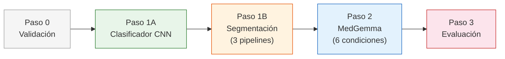
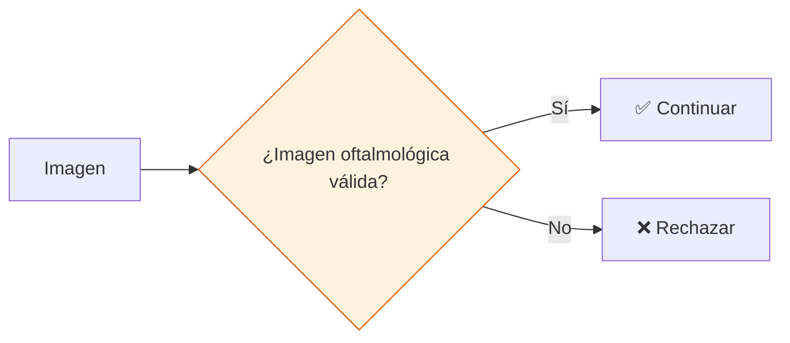
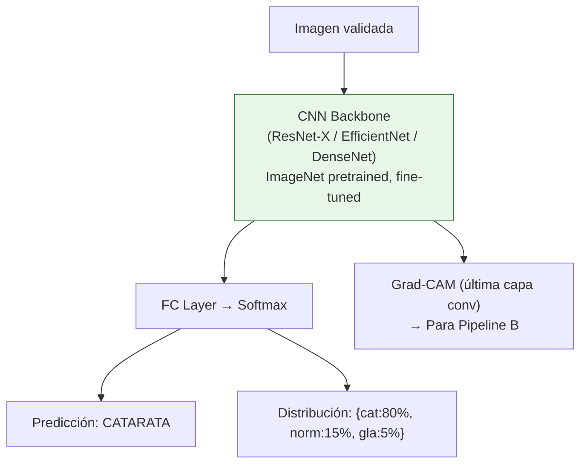
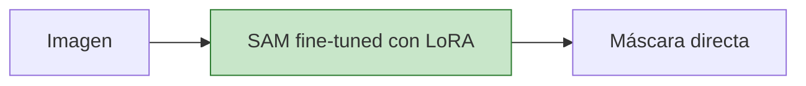
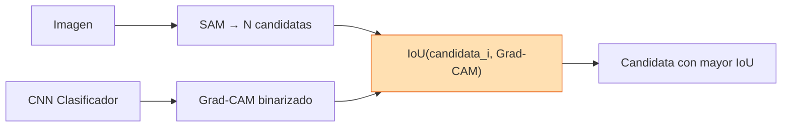
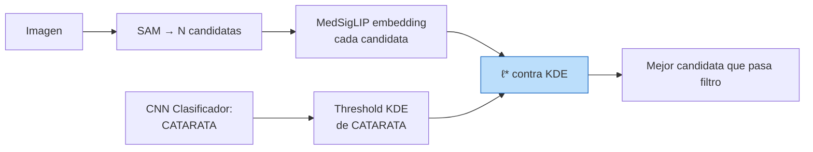
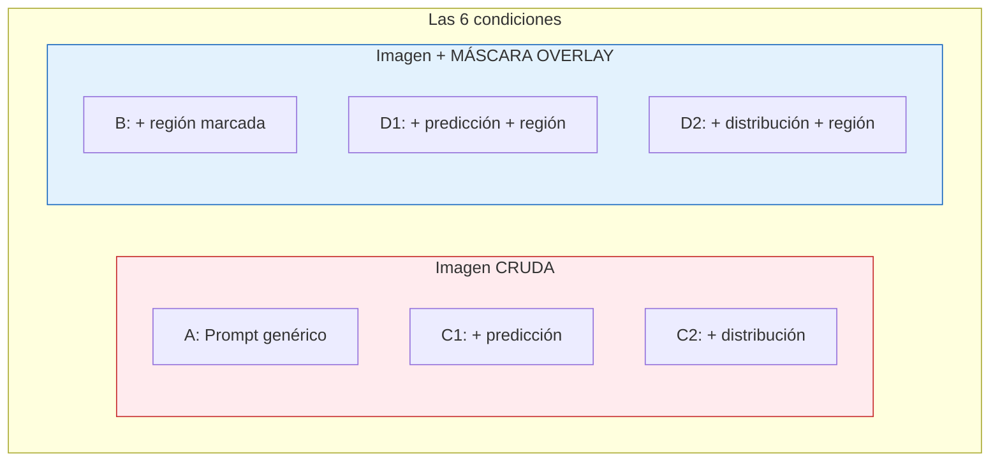

# Pipeline v2.6 — CNN como Clasificador + Experimento de Selección

---

## 1. Vista General



---

## 2. Paso 0 — Validación de Dominio



---

## 3. Paso 1A — Clasificador CNN



**Salidas:**
- `predicción` → clase ganadora
- `distribución` → probabilidades completas (softmax)
- `Grad-CAM` → mapa de activación para Pipeline B (WSSS)

---

## 4. Experimento Previo: Selección del Backbone CNN

Antes de ejecutar el pipeline completo, se debe elegir qué CNN usar como clasificador. Para esto se diseña un experimento comparativo.

### 4.1 Candidatas a evaluar

| # | Backbone | Params | Tamaño aprox. | Profundidad | Característica principal |
|---|----------|--------|---------------|-------------|--------------------------|
| 1 | **ResNet-18** | 11.7M | ~45 MB | 18 capas | Ligero, usado en paper BIP |
| 2 | **ResNet-34** | 21.8M | ~85 MB | 34 capas | Intermedio, mismo estilo que 18 |
| 3 | **ResNet-50** | 25.6M | ~100 MB | 50 capas | Bloques bottleneck, features más ricas |
| 4 | **EfficientNet-B0** | 5.3M | ~20 MB | Compound scaling | Máxima eficiencia params/accuracy |
| 5 | **DenseNet-121** | 8.0M | ~30 MB | 121 capas | Conexiones densas, bueno con pocos datos |

### 4.2 Protocolo experimental

**Dataset:** Imágenes oftalmológicas disponibles (fondo de ojo o segmento anterior), divididas en:
- 70% entrenamiento
- 15% validación
- 15% test

**Entrenamiento (igual para todas):**
- Pretrained en ImageNet
- Fine-tune: descongelar último bloque convolucional + FC layer
- Optimizer: Adam, lr = 1e-4
- Epochs: 30 con early stopping (patience = 5)
- Batch size: 16
- Data augmentation: rotación ±15°, flip horizontal, ajuste de brillo/contraste
- Misma semilla aleatoria para reproducibilidad

### 4.3 Métricas a comparar

Se miden **4 dimensiones** por cada backbone:

#### Dimensión 1: Calidad de clasificación

| Métrica | Descripción |
|---------|-------------|
| **Accuracy** | % de imágenes correctamente clasificadas |
| **F1-Score (macro)** | F1 promediado por clase (maneja desbalance) |
| **Matriz de confusión** | Ver errores entre clases específicas |

#### Dimensión 2: Calidad del Grad-CAM

| Métrica | Descripción |
|---------|-------------|
| **IoU(Grad-CAM, GT mask)** | Qué tanto el Grad-CAM coincide con la región real de la patología |
| **Pointing accuracy** | ¿El punto de máxima activación cae dentro de la máscara GT? |
| **Cobertura** | % de la máscara GT cubierta por el Grad-CAM (sensibilidad espacial) |

> [!IMPORTANT]
> La calidad del Grad-CAM es **crítica** porque afecta directamente al Pipeline B (WSSS). Un backbone con 95% accuracy pero Grad-CAM malo haría que WSSS falle.

#### Dimensión 3: Costo computacional

| Métrica | Descripción |
|---------|-------------|
| **Parámetros totales** | Tamaño del modelo |
| **VRAM en inferencia** | Consumo de GPU al correr (se suma a MedGemma + SAM) |
| **Tiempo de inferencia** | ms por imagen |
| **Tiempo de entrenamiento** | Minutos para converger |

#### Dimensión 4: Rendimiento con pocos datos (few-shot regime)

| Métrica | Descripción |
|---------|-------------|
| **Accuracy con N=50** | ¿Funciona con muy pocas imágenes de entrenamiento? |
| **Accuracy con N=100** | Punto intermedio |
| **Accuracy con N=full** | Rendimiento máximo con todos los datos |

Esto importa porque en oftalmología los datasets anotados son pequeños.

### 4.4 Tabla de resultados esperada

| Backbone | Acc (%) | F1 | IoU Grad-CAM | Pointing | VRAM (MB) | Infer (ms) | Acc@N=50 |
|----------|---------|-----|-------------|----------|-----------|------------|----------|
| ResNet-18 | — | — | — | — | — | — | — |
| ResNet-34 | — | — | — | — | — | — | — |
| ResNet-50 | — | — | — | — | — | — | — |
| EfficientNet-B0 | — | — | — | — | — | — | — |
| DenseNet-121 | — | — | — | — | — | — | — |

### 4.5 Criterio de selección

Se elige el backbone que maximice:

```
Score = 0.30 × F1_norm + 0.30 × IoU_GradCAM_norm + 0.20 × Acc@N50_norm + 0.20 × (1 - VRAM_norm)
```

Es decir:
- **30% clasificación** (F1)
- **30% calidad Grad-CAM** (IoU)
- **20% rendimiento few-shot** (Acc@N=50)
- **20% eficiencia** (menos VRAM = mejor)

> [!NOTE]
> Si dos backbones empatan, se prefiere el más ligero (menor VRAM) porque comparte GPU con MedGemma 4B + SAM.

---

## 5. Paso 1B — 3 Pipelines de Segmentación

### 🟢 Pipeline A: LoRA (segmentador directo)



---

### 🟠 Pipeline B: WSSS (selector por Grad-CAM)



---

### 🔵 Pipeline C: FSL/FD (filtro por KDE)



> [!NOTE]
> En Pipeline C, la CNN solo provee la **clase predicha** para seleccionar el threshold. Los embeddings de las máscaras se extraen con **MedSigLIP** (necesario para el KDE que opera en espacio de 768-dim).

---

## 6. Paso 2 — MedGemma: 6 Condiciones de Ablation

### Tabla de condiciones

| Cond. | Imagen | Prompt | ¿Qué se prueba? |
|-------|--------|--------|-----------------|
| **A** | Cruda | Genérico | Baseline puro |
| **B** | + Máscara overlay | Menciona región marcada | Efecto de mostrar DÓNDE |
| **C1** | Cruda | Con predicción (solo clase) | Efecto de decir QUÉ |
| **C2** | Cruda | Con distribución completa | Efecto de decir QUÉ + confianza |
| **D1** | + Máscara overlay | Con predicción + región | Combinar DÓNDE + QUÉ |
| **D2** | + Máscara overlay | Con distribución + región | Combinar DÓNDE + QUÉ + confianza |



### Prompts exactos

**A — Baseline:**
```
Describe the ophthalmological findings in this fundus image.
```

**B — +Máscara:**
```
The region highlighted in red was identified by an automatic segmentation 
system. Describe the ophthalmological findings, focusing on the 
highlighted region.
```

**C1 — +Predicción (solo clase):**
```
An ophthalmological classifier identifies the primary finding in this 
fundus image as: glaucoma. Describe the ophthalmological findings.
```

**C2 — +Distribución completa:**
```
An ophthalmological classifier analyzed this fundus image and estimates: 
glaucoma (92%), normal (8%). Describe the ophthalmological 
findings.
```

**D1 — +Máscara + Predicción:**
```
An ophthalmological classifier identifies the primary finding as: glaucoma. 
The region highlighted in red indicates the area where this finding is 
located. Describe the findings focusing on the highlighted region.
```

**D2 — +Máscara + Distribución:**
```
An ophthalmological classifier estimates: glaucoma (92%), normal (8%). 
The region highlighted in red indicates the area where the 
main finding is located. Describe the findings in detail, focusing on 
the highlighted region and its relationship with the suggested diagnosis.
```

---

## 7. Paso 3 — Evaluación Comparativa

### Métricas de segmentación (constantes por pipeline)

| Métrica | Qué mide | Por qué incluirla |
|---------|----------|-------------------|
| **IoU** | Superposición máscara↔GT | Estándar en segmentación semántica; usada en paper BIP |
| **Dice** | F1-Score para segmentación | Complementa IoU; estándar en segmentación médica |
| **SSIM** | Similitud estructural | Calidad perceptual; detecta errores de forma |

### Métricas de texto (varían por condición)

| Métrica | Qué mide |
|---------|----------|
| **BERTScore** | Similitud semántica vs texto de referencia |
| **sBERT** | Similitud semántica usando embeddings clínicos |
| **Precisión de hallazgos** | ¿Menciona la patología correcta? |
| **Likert 1-5** | Calidad clínica (evaluación por oftalmólogo) |

### Matriz experimental: 3 pipelines × 6 condiciones = 18 configs

| | A | B | C1 | C2 | D1 | D2 |
|---|---|---|---|---|---|---|
| **🟢 LoRA** | LoRA-A | LoRA-B | LoRA-C1 | LoRA-C2 | LoRA-D1 | LoRA-D2 |
| **🟠 WSSS** | WSSS-A | WSSS-B | WSSS-C1 | WSSS-C2 | WSSS-D1 | WSSS-D2 |
| **🔵 FSL/FD** | FSL-A | FSL-B | FSL-C1 | FSL-C2 | FSL-D1 | FSL-D2 |

> [!IMPORTANT]
> Dentro de cada fila, las métricas de segmentación **(IoU, Dice, SSIM) son constantes**. Lo que varía entre columnas son las **métricas de texto (BERTScore, sBERT)**.

### Comparaciones experimentales

Las 6 condiciones forman un diseño factorial 2×3 (Máscara × Info textual):

```
                    Nada        Predicción    Distribución
Sin máscara          A             C1              C2
Con máscara          B             D1              D2
```

#### Efecto de la información textual (misma fila)

| Comparación | Pregunta |
|---|---|
| **A vs C1** | ¿Decirle solo la clase mejora la descripción? |
| **A vs C2** | ¿Dar probabilidades completas mejora la descripción? |
| **C1 vs C2** | ¿Importa dar la confianza o basta la clase? |
| **B vs D1** | Con máscara, ¿agregar la clase mejora algo más? |
| **B vs D2** | Con máscara, ¿agregar probabilidades mejora? |
| **D1 vs D2** | Con máscara y clase, ¿la distribución importa? |

Cada comparación cambia **un solo factor** (info textual) mientras fija el otro (máscara), aislando su efecto.

#### Efecto de la máscara (misma columna)

| Comparación | Pregunta |
|---|---|
| **A vs B** | ¿Mostrar DÓNDE está la patología mejora el texto? |
| **C1 vs D1** | Cuando sabe QUÉ es, ¿ver DÓNDE mejora? |
| **C2 vs D2** | Con distribución, ¿la máscara mejora? |

#### Efecto combinado e interacción

| Comparación | Pregunta |
|---|---|
| **A vs D2** | ¿El condicionamiento completo supera al baseline? |
| **D2 - C2 - B + A > 0?** | ¿Hay sinergia entre máscara y distribución? |

#### Entre pipelines

| Comparación | Pregunta |
|---|---|
| **LoRA-D2 vs WSSS-D2 vs FSL-D2** | ¿La calidad de la máscara afecta la calidad del texto? |

---

## 8. Trabajo Futuro (No implementar por ahora)

> [!NOTE]
> Los siguientes módulos quedan definidos conceptualmente pero **no se implementan** en esta fase.

- **Incertidumbre Tri-Modal (UQ):** Coherencia espacial + semántica + distribucional
- **Explicabilidad (XAI):** Heatmaps, desgloses de contribución, coherencia texto↔máscara
